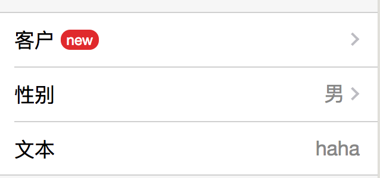
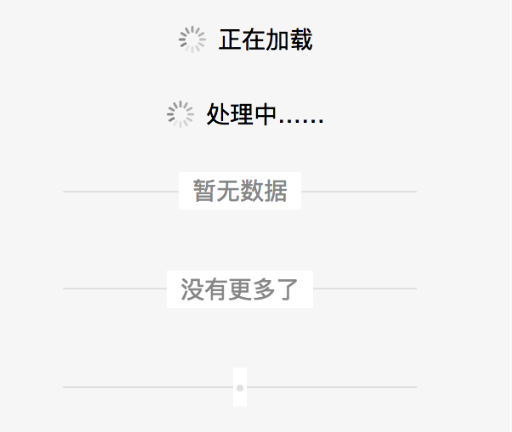

# 模板

## List

数据类型|属性名称|是否必填|说明
--------|--------|--------|---
object|`items`|R|列表元素
string|`header`|O|列表标题

`items` 对象参数

数据类型|属性名称|是否必填|说明
--------|--------|--------|---
object|`content`|R|列表元素内容
object|`action`|O|列表元素动作

`items.content` 对象参数

数据类型|属性名称|是否必填|说明
--------|--------|--------|---
string|`header`|O|头部图片 url
string|`body`|R|名称
string|`footer`|O|值
string|`badge`|O|徽章内容。支持特殊值 `'dot'`, 表示小红点

`items.action` 对象参数

数据类型|属性名称|是否必填|说明
--------|--------|--------|---
string|`name`|O| 可选值：`navigate`, `tap`, 分别表示页面跳转和自定义事件
string|`url`|O| 页面跳转 URL, 仅当 `name` 值为 `navigate` 时有效
string|`bind`|O| 绑定自定义事件函数名称, 仅当 `name` 值为 `tap` 时有效
object|`dataset`|O| 绑定自定义事件函数携带数据集, 仅当 `name` 值为 `tap` 时有效. 

例子：

```xml
<import src="../templates/list.wxml"/>
<template is="list" data="{{...list}}"/>
```

```js
Page({
  data: {
    list: {
      header: '基本信息',
      items: [
        {
          content: { body: '客户', badge: 'new'  },
          action: { name: 'navigate', url: '/pages/customer/index'},
        },
        {
          content: { body: '性别', footer: '男' },
          action: { name: 'tap', bind: 'chooseSex'},
        },
        {
          content: { body: '自定义数据'},
          action: { name: 'tap', bind: 'go', dataset: {id: 1, name: 'jim'}},
        },
        {
          content: { body: '文本', footer: 'haha'},
        },
      ],
    },
  },
  chooseSex: function() {
    wx.showActionSheet({
      itemList: ['男', '女', '不愿透漏'],
      success: function(res) {
        console.log(res.tapIndex)
      },
      fail: function(res) {
      }
    })
  },
  go: function(e) {
    console.log(e.target.dataset.set) // {id: 1, name: 'jim'} 得到自定义数据
  },
})
```

效果图：



## Panel

数据类型|属性名称|是否必填|说明
--------|--------|--------|---
string|`header`|O| Panel 头
array|`items`|R| Panel body 内条目。里面包含多个 item 对象，item 对象参数定义见下方
object|`footer`|O| Panel 脚
array|`actions`|O| Panel 操作。借鉴自 Preview 操作按钮区域。


`footer` 对象参数

数据类型|属性名称|是否必填|说明
--------|--------|--------|---
string|`text`|R| 底部链接文字内容，例如“查看更多”
string|`url`|R| 跳转地址

`items` 中 item 对象参数

数据类型|属性名称|是否必填|说明
--------|--------|--------|---
string|`type`|R| 类别，可用值：`appmsg`, `smallAppmsg`, `text`, 分别表示标准图文、小图文和文本内容
string|`title`|R| 标题
string|`desc`|O| 描述信息。type 值为 `smallAppmsg` 时无效
string|`thumbnail`|O| 缩略图 url。仅对 `appmsg` 和 `smallAppmsg` 两种类型有效
string|`url`|O| 跳转地址。仅对 `appmsg` 和 `smallAppmsg` 两种类型有效
string|`budge`|O| 徽章，仅对 `appmsg` 有效。 支持特殊值 `'dot'`, 表示小红点

效果图：配置实例可参考 [Panel Demo 页面](/pages/demo/panel.js).


## Loadmore

包含三种显示样式，模板名称分别是：`loading`, `line` and `dot`, 其中前两个可以自定义文字信息。

数据类型|属性名称|是否必填|默认值|说明
--------|--------|--------|------|----
string|`text`|O|`正在加载` (for `line`), `暂无数据` (for `dot`)| 自定义文本信息

```xml
<import src="../templates/loadmore.wxml"/>

<template is="loading"/>
<template is="loading" data="{{text: '处理中……'}}"/>
<template is="line"/>
<template is="line" data="{{text: '没有更多了'}}"/>
<template is="dot"/>
```
效果图：



## Message

数据类型|属性名称|是否必填|默认值|说明
--------|--------|--------|------|---
string|`icon`|O|`success`| 图标名称(icon 组件中 type 属性值,如 `success`, `info`, `warn` 等)
string|`title`|R|| 标题
string|`desc`|O|| 描述文字
array|`buttons`|R|| 操作按钮列表，单个按钮参数如下

`buttons` 中对象参数 

数据类型|属性名称|是否必填|默认值|说明
--------|--------|--------|------|---
string|`url`|R|| 跳转地址。使用 redirect 动作
string|`text`|R|| 按钮文字内容
string|`type`|O|`default`| 按钮样式. `primary`, `default` 等
string|`method`|O|`navigate`| 对应 navigator 组件 `open-type` 属性值。注意：该属性值必须与 url 中指定的页面相匹配，例如，如果 page 是 tab page, 则值必须是 `switchTab`

完整范例：

```xml
<import src="../templates/message.wxml"/>
<template is="message" data="{{...message}}"/>
```

```js
message: {
  icon: 'success',
  title: 'Done',
  desc: 'ggo',
  buttons: [
    {
      url: '/pages/index/index',
      text: '返回首页',
      type: 'primary',
      method: 'switchTab',
    },
    {
      url: '/pages/customer/index',
      type: 'default',
      text: '放弃',
    },
  ],
},
```

## Input

类似 Yii2 中的 form field, 所有表单元素都放在 list 模板内，结构大致为：

```xml
<import src="../templates/input.wxml"/>

<view class="page">
  <view class="page-body">
    <form bindsubmit="submitForm" bindreset="resetForm">
      <view class="weui-cells weui-cells_after-title">
        <!-- 所有模板都放在 .weui-cells 内 -->
        <template is="textarea" data="{{name: 'note', placeholder: '拜访内容', style: 'height: 8em'}}"/>
      </view>
    </form
  </view>
</view>
```

### input

数据类型|属性名称|是否必填|默认值|说明
--------|--------|--------|------|---
string|`name`|R|| 文本输入框名称
string|`label`|O|| 标签
string|`placeholder`|O||
string|`type`|O| `text` |其它可选值：`number`, `digit`, `idcard`
string|`focus`|O|false|

示例：

```
<import src="../templates/input.wxml"/>
<template is="input" data="{{name: 'title', label: '标题', placeholder: '8 个字以内'}}"/>
<template is="input" data="{{name: 'phone', placeholder: '手机号码'}}"/>
```

### textarea

和 input 模板相比，少了 `label` 属性，多了 `style` 属性。

数据类型|属性名称|是否必填|默认值|说明
--------|--------|--------|------|---
string|`name`|R|| 文本输入框名称
string|`placeholder`|O||
string|`style`|O|| `<textarea>` 标签 `style` 值，主要用来控制高度，例如 `height: 3em;`
string|`value`|O|| 初始值

示例：

```
<import src="../templates/input.wxml"/>
<template is="textarea" data="{{name: 'note', placeholder: '备注', style: 'height: 3em'}}"/>
```

### uploader


数据类型|属性名称|是否必填|默认值|说明
--------|--------|--------|------|---
array|`files`|R|| 文件列表，默认可以设置为 `[]`
string|`previewHandlerName`|R|| 预览选择的照片 handler name
string|`chooseHandlerName`|R|| 选择照片 handler name,
string|`title`|O|| 描述性文字

示例：

```xml
<import src="../templates/input.wxml"/>
<template is="uploader" data="{{...uploader}}"/>
```

```js
Page({
  data: {
    uploader: {
      title: '图片上传',
      files: [],
      previewHandlerName: 'previewImage',
      chooseHandlerName: 'chooseImage',
    },
  },
  chooseImage: function (e) {
    var page = this;

    if (page.data.uploader.files.length > 0) {
      wx.showToast({title: '至多可上传一张图片'})
      return false
    }

    wx.chooseImage({
      sizeType: ['compressed'],
      sourceType: ['album', 'camera'],
      success: function (res) {
        // 返回选定照片的本地文件路径列表，tempFilePath可以作为img标签的src属性显示图片
        page.setData({
          "uploader.files": page.data.uploader.files.concat(res.tempFilePaths)
        });
      }
    })
  },
  previewImage: function(e){
    wx.previewImage({
      urls: this.data.uploader.files // 需要预览的图片http链接列表
    })
  },
})
```

### Checkbox List

复选框列表

数据类型|属性名称|是否必填|默认值|说明
--------|--------|--------|------|---
string|`handler`|R||复选框发生改变时的触发函数
array|`items`|R|| 条目数据，单个对象的格式是 `{name: '', value: '', checked: true}`

实例：

```xml
<import src="../templates/input.wxml"/>

<view class="weui-cells__title">员工</view>
<view class="weui-cells weui-cells_after-title">
  <template is="checkboxList" data="{{...attachment}}"/>
</view>
```

```js
Page({
  data: {
    attachment: {
      handler: 'checkAttachment',
      items: [
        {name: '发货清单', value: 1, checked: true},
        {name: '发票', value: 2},
      ],
    },
  },
  // e.detail.value 是一个数组，数组元素是当前选中条目的值
  checkAttachment: function (e) {
    console.log(e.detail.value)
  },
})
```

复选框的 change handler 有一个必须的操作——根据用户选择的值重新赋值 page data, 为了方便期间，将此操作抽象成如下函数，放在 App 内：

```js
App ({
  // 通用的 checkbox list 样式同步函数
  syncCheckboxList: function (items, values, showName = false) {
    var names = []
    items.forEach(function (item, i) {
      items[i].checked = false
      values.forEach(function (value, j) {
        if (items[i].value == values[j]){
          items[i].checked = true
          names.push(items[i].name)
        }
      })
    })
    return showName ? [items, names] : items
  },
})
```

此函数有三个参数，声明格式如下：

- array `items`: checkboxList 模板中 `items` 的值；
- array `values`: 用户当前选中的值数组，即 change hanlder 内 `e.detail.value`;
- bool `showName`: 是否返回选中条目名称的数组，默认是 false, 当为 true 时，返回值将是一个数组。以上面的例子为例，假设用户选择的附件有发票和发货清单，当 `showName` 为 false 时返回值是 `[{name: '发货清单', value:1, checked: true}, {name: '发票', value:2, checked: true}]`; 值为 true 时返回值是 `[ [{name: '发货清单', value:1, checked: true}, {name: '发票', value:2, checked: true}], ['发票', '发货清单'] ]`, 此参数的具体应用场景可参见抄送范围操作；

借助这个函数，上面的 `checkAttachment` handler 改成：

```js
checkAttachment: function (e) {
  var page = this
    , result = app.syncCheckboxList(page.data.attachment.items, e.detail.value, true)
  page.setData({
    attachmentIds: e.detail.value,
    'attachment.items': result[0],
    'names[1]': result[1],
  })
},
```


# Preview

Preview 模板的主要功能是进行表单提交前的数据预览，它也适合用在模型详情页的展示。和 Panel, list 等模板相比，它的优点是显示长文本很方便。Preview 模板有点类似 Yii2 DetailView widget, 后者用一个多行两列的表格逐一显示模型的属性。

数据类型|属性名称|是否必填|默认值|说明
--------|--------|--------|------|---
array|`items`|R|| 条目数据，单个对象的格式是 `{label: '', value: ''}`
null, object|`header`|O|`null`| 对象结构和 `items` 中 item 相同，适合放置总金额之类的信息。
null, array|`actions`|O|`null`| 底部的操作导航，不要超过三个。每个导航的结构与 List 模板中 `actions` 属性中元素基本相同（多了一个 `text` 属性，表示按钮文字）。

示例：

```xml
<import src="../templates/preview.wxml"/>
<template is="preview" data="{{...preview}}"/>
```

```js
preview: {
  header: {label: '金额', value: '￥1024.00'},
  items: [
    {label: '姓名', value: 'go'},
    {label: '地址', value: ':go:go:go:go:go:go:go:go:go:go:go:go:go:go:go:go:go:go:go:go:go:go:go:go:go:go:'},
  ],
  actions: [
    {
      name: 'tap',
      bind: 'viewAddress',
      text: '查看地址',
      dataset: {
        id: 35
      },
    },
    {
      name: 'navigate',
      url: '/pages/index/index',
      method: 'switchTab',
      text: '确认',
      type: 'primary',
    },
  ],
},
```
